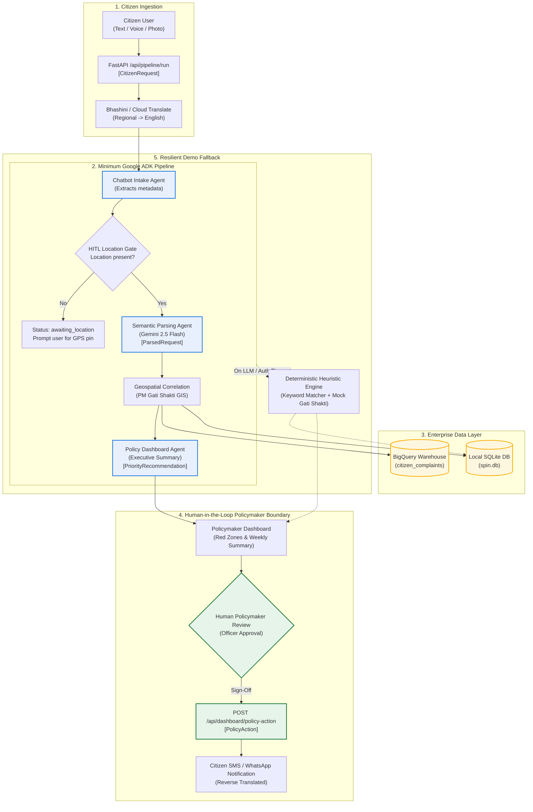

# 04 — Minimum Google ADK Architecture Decision

**Document:** `docs/day1/04-minimum-adk-architecture.md`  
**Classification:** VERIFIED (Inspected from `spin_agents/agent.py` and `spin_agents/runner.py`)  
**Status:** Architectural Decision & Mermaid Topology

---

## 1. Executive Summary

SPIN uses the **Google Agent Development Kit (google-adk 2.7.1)** for multi-agent orchestration. The repository supports two topologies:
1. `local_pipeline` (`SequentialAgent` monolithic execution).
2. `distributed_pipeline` (`RemoteA2aAgent` microservices via Agent-to-Agent protocol).

For the Hackathon Demo, the minimum viable ADK pipeline must be deterministic, resilient to network/API throttling, fast (< 5s latency), and capable of showcasing end-to-end multimodal intelligence without getting stuck on missing credentials.

---

## 2. Agent Inventory & Responsibility Analysis

| Agent / Stage | Class / Engine | Tools Attached | Genuine LLM vs Deterministic | Role in Pipeline | Status in Current Code |
|:---|:---|:---|:---|:---|:---|
| **1. Chatbot Intake Agent** | `LlmAgent` (`gemini-2.5-flash`) | `bhashini_translate_tool` | **Genuine LLM** | Extracts intake metadata, translates text, checks if GPS/location is provided. | **ACTIVE** (Stage 1 of `local_pipeline`) |
| **2. HITL Location Gate** | `BaseAgent` (`HitlLocationGate`) | None | **Deterministic Python** | Evaluates `intake.get("hitl_required")`. If missing location, pauses pipeline (`escalate=True`) and prompts citizen. | **ACTIVE** (Stage 2 of `local_pipeline`) |
| **3. Semantic Parsing Agent** | `LlmAgent` (`gemini-2.5-flash`) | `vision_analyze_tool` | **Genuine LLM** | Classifies grievance into 21 civic categories and issue subtypes; assigns severity (1-10) and confidence (0.0-1.0). | **ACTIVE** (Stage 3 of `local_pipeline`) |
| **4. Other Resolver Agent** | `LlmAgent` (`gemini-2.5-flash`) | None | **Genuine LLM** | Second-chance classifier for complaints initially labeled as `Other (Uncategorized)`. | **DISCONNECTED** (Exported in `AGENT_REGISTRY`, but excluded from `SequentialAgent`) |
| **5. Geospatial Correlation Agent** | `LlmAgent` (`gemini-2.5-flash`) | `gati_shakti_query_tool`, `bigquery_insert_tool` | **Deterministic Tool Routing** (Uses LLM solely to invoke tools in sequence) | Queries PM Gati Shakti GIS layers and inserts grievance record into BigQuery warehouse. | **ACTIVE** (Stage 4 of `local_pipeline`) |
| **6. Policy Dashboard Agent** | `LlmAgent` (`gemini-2.5-flash`) | `bigquery_summary_tool`, `bhashini_reverse_notify_tool` | **Genuine LLM + Tool** | Aggregates weekly metrics and writes 3-sentence natural language executive summary for policymakers. | **ACTIVE** (Stage 5 of `local_pipeline`) |

---

## 3. Minimum ADK Pipeline Decision for Hackathon Demo

### A. Essential Demo Stages (Must Run)
1. **Intake & HITL Location Gate:** Demonstrates multimodal ingestion and ensures location is validated before downstream processing.
2. **Semantic Classification (Gemini 2.5 Flash):** Showcases LLM reasoning, multilingual understanding, civic taxonomy mapping, and severity scoring.
3. **Geospatial & Gati Shakti Correlation:** Showcases government GIS integration by detecting delayed public works near citizen issues.
4. **Policy Recommendation & Executive Summary:** Generates explainable policy recommendations for dashboard display.

### B. Redundant / Disconnected Stages
- **`other_resolver_agent`:** Currently orphaned. For the Hackathon demo, keeping the main `semantic_parsing_agent` instructions comprehensive is sufficient. Reconnecting `other_resolver_agent` creates an extra LLM round-trip (+2s latency). **Recommendation:** Keep disconnected for Demo Day; activate in post-hackathon iteration.
- **`distributed_pipeline` (A2A Remote Agents):** Requires spinning up 4 separate Cloud Run containers on ports 8001-8004. **Decision:** Use `local_pipeline` monolithically for local demo stability.

### C. LLM vs Deterministic Python Optimization
- `geospatial_correlation_agent` currently asks an LLM to call `gati_shakti_query_tool` and then call `bigquery_insert_tool`.
- Wrapping deterministic database inserts inside an LLM introduces fragility (e.g. JSON escaping errors, network timeouts, or schema mismatches).
- **Recommendation:** Perform data enrichment and BigQuery insertion via deterministic Python services in the runner, reserving Gemini/ADK for reasoning, translation, semantic parsing, and executive synthesis.

---

## 4. Mermaid Architecture & Dataflow Diagram

