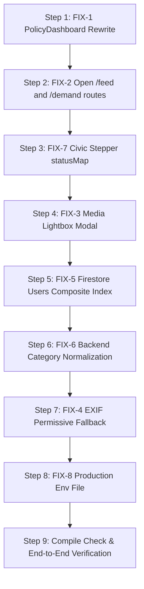

# SPIN Platform — Master Implementation Plan (Remediation & Hardening)

> **Generated:** 2026-10-01 from Codebase Verification & Audit (`verification.md`).  
> **Status:** Draft / Pending User Comments & Review  
> **Scope:** FIX-1 through FIX-8 (Resolving 2 Critical Failures, 6 Hardening/Partial Gaps)

---

## 1. Architecture & Dependencies

### High-Level Architecture
- **Frontend SPA (React 19 / Vite / TailwindCSS / Leaflet / Firebase Web SDK):**
  - **Citizen Portal:** Unguarded public routes (`/feed`, `/demand/:demand_id`, `/track`) enabling viral link sharing and JIT voting; authenticated actions (proposals, profile) guarded by `<RequireCitizenAuth>`.
  - **Staff / Admin Portal:** Isolated layout under `<StaffLayout>` and `<RequireStaffAuth>`, enforcing role hierarchy (`platform_admin` > `state_admin` > `district_admin` > `department_officer` > `field_officer`, plus policymaker `/admin-dashboard`).
- **Backend API (FastAPI / Pydantic / Google Gemini AI / Firebase Admin SDK):**
  - RESTful APIs scoped by district/department.
  - LLM pipeline for multilingual translation, semantic categorization, and policy brief generation.
- **Data Layer (Cloud Firestore & Firebase Storage):**
  - Canonical collection schema: `demands`, `users`, `demand_votes`, `action_dispatches`, `timeline`.
  - Firebase Storage path: `demands/{uid}/{timestamp}_{filename}`.

### Dependencies & Versions
- **Existing Frontend Libraries:** `leaflet` (`^1.9.4`), `leaflet.heat` (`^0.2.0`), `lucide-react`, `react-router-dom` (`^6.x`).
- **No new external npm packages required:** Lightbox modal implemented with React state + Tailwind overlay; Heatmap uses existing `leaflet.heat`.
- **Backend Dependencies:** `google-generativeai`, `firebase-admin`, `fastapi`, `uvicorn`.

---

## 2. Navigation & RBAC Isolation

### Task 2.1: Open Public Civic Routes (`/feed`, `/demand/:id`) [FIX-2]
- **File:** `frontend/dashboard/src/App.tsx`
- **Objective:** Allow viral link distribution (WhatsApp/SMS) without auth barrier.
- **Changes:**
  - Remove `<RequireCitizenAuth>` wrapper from:
    - Route `path="/feed"` -> `<CitizenPortalHome ... />`
    - Route `path="/demand/:demand_id"` -> `<DemandDetail ... />`
  - Retain `<RequireCitizenAuth>` on creation/profile paths:
    - `path="/submit"`, `path="/my-demands"`, `path="/profile"`.
- **Component Safety Updates:**
  - In `CitizenPortalHome.tsx`: Check `currentUser` nullability. If unauthenticated, show "Sign in to vote & propose" banner or gracefully allow browsing without crashing.
  - In `DemandDetail.tsx`: Already contains JIT voting logic (stores `pending_vote_demand_id` in `localStorage` and redirects to `/login`). Ensure page renders all demand details, stepper, map, and timeline without requiring auth.

### Task 2.2: Ensure Air-Tight Staff Layout Segregation
- Verify `StaffLayout.tsx` and `StaffNavbar.tsx` do not import or render citizen components (`CitizenNavbar`, citizen bottom bars).
- Confirm all administrative routes (`/admin/platform`, `/admin/state`, `/admin/district`, `/staff-dashboard`, `/admin-dashboard`) are guarded by `<RequireStaffAuth allowedRoles={[...]}>`.

---

## 3. Frontend UI & State Fixes (React/Vite)

### Task 3.1: PolicyDashboard Rewrite (`/admin-dashboard`) [FIX-1]
- **File:** `frontend/dashboard/src/components/PolicyDashboard.tsx`
- **Root Problem:** Reverted component exports `PolicyDashboard()` with zero props, but callers pass `user={staffUser}` (TS2322 compile error). Additionally, it calls deprecated endpoints (`/api/dashboard/summary`, `/api/dashboard/red-zones`) returning 404.
- **Contract & Props:**
  ```tsx
  interface PolicyDashboardProps {
    user: StaffUser;
  }
  ```
- **Data Fetching Integration (using actual FastAPI endpoints):**
  1. `GET /api/policy/metrics?district_id={user.district_id}&time_range={range}`
     - Yields: `escalated_count`, `approved_for_budget_count`, `budget_allocated_inr`, `avg_resolution_days`, `department_breakdown`, `vote_velocity_trends`.
  2. `GET /api/policy/map-signals?district_id={user.district_id}&category={category}`
     - Yields: Array of `{ lat: number, lng: number, weight: number, title: string, category: string, votes: number, urgency: number, demand_id: string }`.
  3. `GET /api/policy/execution/queue?district_id={user.district_id}&page=1&limit=20`
     - Yields: Demands in `approved_for_budget` or `escalated_to_policy` status waiting for policy/budget signoff.
  4. `POST /api/policy/execution/{demand_id}/enact`
     - Body: `{ allocated_budget_inr: number, department: string, notes: string, contractor_id?: string }`
     - Action: Updates demand status to `fulfilled` and appends policy timeline event.
  5. `POST /api/policy/ai-advisor`
     - Body: `{ district_id: string, department_filter?: string }`
     - Yields: Streaming/Markdown AI brief generated by Gemini with 4 actionable recommendations.
- **UI Sections to Implement:**
  - **Header:** District context badge (`user.district_id`), time range filter (`7d`, `30d`, `90d`, `all`), refresh button.
  - **KPI Cards:** Escalated Demands, Total Budget Allocated (₹), Approved Awaiting Enactment, Avg Resolution Velocity.
  - **Interactive Heatmap / Signal Map:** Leaflet map with `L.heatLayer` utilizing the `map-signals` payload (`lat, lng, weight`), with toggleable marker tooltips for hotspots.
  - **Budget Execution Queue Table:**
    - Columns: Title, Category, Votes, Severity, Estimated Cost (₹), Status, Action.
    - "Allocate & Enact" CTA opening an enactment modal with budget input & confirmation.
  - **AI Policy Brief Panel:**
    - "Generate Intelligence Brief" CTA triggering `/api/policy/ai-advisor`.
    - Rich Markdown display with executive recommendations and resource allocation advice.
- **Cleanup:**
  - Deprecate/remove legacy dead files: `usePolicyData.ts`, `HeatMap.tsx`, `ExecutiveSummaryPanel.tsx`, `BudgetReallocationPanel.tsx` that referenced the dead endpoints.

### Task 3.2: Media Gallery Lightbox in `DemandDetail.tsx` [FIX-3]
- **File:** `frontend/dashboard/src/components/DemandDetail.tsx`
- **Problem:** Clicking evidence images opens a raw browser tab.
- **Implementation:**
  - Add state: `const [activeLightboxImage, setActiveLightboxImage] = useState<string | null>(null);`
  - In the media grid, update image `onClick` to `setActiveLightboxImage(imgUrl)` instead of opening in a new tab.
  - Render an accessible modal overlay when `activeLightboxImage !== null`:
    - Fullscreen backdrop with backdrop-blur (`bg-black/80 backdrop-blur-sm z-50 fixed inset-0`).
    - Centered max-h-[90vh] image with `object-contain`.
    - Close button (`ESC` key listener + clicking backdrop + top-right close icon).

### Task 3.3: Correct Civic Stepper Status Mapping [FIX-7]
- **File:** `frontend/dashboard/src/components/DemandDetail.tsx`
- **Problem:** `statusMap` currently maps only `SUBMITTED`, `UNDER_REVIEW`, `RESOLVED`, collapsing intermediate backend workflow states.
- **Implementation:**
  ```typescript
  const statusMap: Record<string, number> = {
    // Stage 0: Citizen Initiation & Velocity
    "gathering_support": 0,
    "submitted": 0,
    // Stage 1: Department Triaged
    "under_review": 1,
    // Stage 2: Field Ground Verification
    "field_survey": 2,
    "feasibility_reported": 2,
    // Stage 3: Escalated / Policy & Budget
    "escalated_to_policy": 3,
    "approved_for_budget": 3,
    // Stage 4: Execution / Fulfilled
    "fulfilled": 4,
    "resolved": 4,
    "rejected": -1
  };
  ```
  - Handle rejected/flagged status with distinct red indicator.

### Task 3.4: Production API Environment Configuration [FIX-8]
- **File:** `frontend/dashboard/.env.production`
- **Implementation:**
  - Create or update `.env.production` with:
    ```env
    VITE_API_URL=https://api.niketandoes.me/api
    VITE_FIREBASE_AUTH_DOMAIN=spin-portal-hack-106.firebaseapp.com
    ```
  - Ensure development `.env` remains `http://localhost:8080`.

---

## 4. Backend API Fixes (FastAPI)

### Task 4.1: Canonical Category Enum Normalization at Ingestion [FIX-6]
- **File:** `backend/spin_agents/demand_service.py`
- **Problem:** Gemini parser returns display categories like `"Roads & Transport"` or `"Water Supply"`. The DB write raw-persists these strings instead of canonical keys (`"roads"`, `"water"`), causing mismatches with staff department filtering.
- **Implementation:**
  - Define canonical enum mapping in `demand_service.py`:
    ```python
    CATEGORY_MAPPING = {
        "roads & transport": "roads",
        "roads": "roads",
        "road": "roads",
        "water supply": "water",
        "water": "water",
        "electricity & power": "electricity",
        "electricity": "electricity",
        "sanitation & waste": "garbage",
        "garbage": "garbage",
        "drainage & sewage": "drainage",
        "drainage": "drainage",
        "public infrastructure": "other",
        "other": "other",
    }
    ```
  - In `persist_demand_to_db()` (around line 169):
    ```python
    raw_cat = (parsed_data.get("category") or "other").strip().lower()
    canonical_category = CATEGORY_MAPPING.get(raw_cat, "other")
    data["category"] = canonical_category
    ```

### Task 4.2: Field Survey EXIF Handling Clarification [FIX-4]
- **File:** `backend/spin_agents/staff_router.py:292-294`
- **Plan:**
  - Keep EXIF GPS validation permissive with an explicit fallback check:
    If EXIF GPS metadata exists in uploaded photos, validate that distance to demand location is `<= 500m`. If EXIF is stripped (as standard browser camera uploads or WhatsApp web often strip EXIF), log a warning and accept the field officer survey submission with `exif_verified: false` rather than rejecting HTTP 400.
  - This prevents field survey submission failures during hackathon live testing while preserving the security check when EXIF is present.

---

## 5. Database Schema & Data Model Adjustments (Firestore)

### Task 5.1: Missing Composite Index for Staff Users [FIX-5]
- **File:** `firestore.indexes.json`
- **Implementation:** Add compound index for querying staff officers by district and role:
  ```json
  {
    "collectionGroup": "users",
    "queryScope": "COLLECTION",
    "fields": [
      { "fieldPath": "district_id", "order": "ASCENDING" },
      { "fieldPath": "role", "order": "ASCENDING" }
    ]
  }
  ```

### Task 5.2: Verification of Existing Demand Indexes
- Confirm existing composite indexes in `firestore.indexes.json`:
  - `demands`: `[district_id, category, status, created_at DESC]`
  - `demands`: `[assigned_officer_id, status, created_at DESC]`
  - `demands`: `[author_user_id, created_at DESC]`

---

## 6. Security Constraints & Edge Cases

1. **JIT Voting Auth Transitions:**
   - When an unauthenticated citizen clicks "Upvote" on `/demand/:id`, `pending_vote_demand_id` is saved.
   - Upon redirect to `/login` and completion, the vote is submitted idempotently using doc ID `{demand_id}_{user_id}`.
   - If user cancels login, returning to `/feed` or `/demand/:id` must not cause stuck state.
2. **Policy Enactment Transactional Integrity:**
   - `POST /api/policy/execution/{id}/enact` must verify that demand status is either `approved_for_budget` or `escalated_to_policy`.
   - Prevent duplicate enactments using Firestore transactions.
3. **Cross-District Data Leak Prevention:**
   - Policy and Staff queries must strictly enforce `district_id` filtering matching the authenticated staff token (except for `platform_admin`).

---

## 7. Step-by-Step Execution Plan



| Step | Priority | Task | File(s) | Description |
|:---:|:---:|:---|:---|:---|
| **1** | 🔴 Critical | **FIX-1** | `PolicyDashboard.tsx` | Rewrite component: accept `user` prop, wire real `/api/policy/*` endpoints, render Leaflet heat signals, Execution Queue, and AI Policy Brief. Delete dead files. |
| **2** | 🔴 Critical | **FIX-2** | `App.tsx`, `CitizenPortalHome.tsx` | Remove `<RequireCitizenAuth>` from `/feed` and `/demand/:demand_id` for viral WhatsApp sharing; guard anonymous user null pointer exceptions. |
| **3** | 🟡 Medium | **FIX-7** | `DemandDetail.tsx` | Fix `statusMap` to map all 7 backend lifecycle statuses to 5-stage civic stepper. |
| **4** | 🟡 High | **FIX-3** | `DemandDetail.tsx` | Add full-screen lightbox image modal for evidence viewing without leaving portal. |
| **5** | 🟡 High | **FIX-5** | `firestore.indexes.json` | Add `[district_id, role]` composite index for `users` collection. |
| **6** | 🟡 Medium | **FIX-6** | `demand_service.py` | Add category enum normalization in backend to map raw Gemini display strings to canonical DB keys (`roads`, `water`, etc.). |
| **7** | 🟢 Low | **FIX-4** | `staff_router.py` | Soften EXIF check: validate if present (<=500m), gracefully permit with warning if stripped. |
| **8** | 🟢 Low | **FIX-8** | `.env.production` | Configure production API URL `https://api.niketandoes.me/api`. |
| **9** | 🏁 Final | **Audit & Tracking** | `niketan-changes.md` | Log all modifications with rationale per workspace memory rule. |

---

## 8. Testing & Validation Steps

1. **Frontend Compilation Check:**
   - Run `npx tsc --noEmit` in `frontend/dashboard` to verify TS2322 is resolved and zero TypeScript errors exist.
2. **Citizen Route Accessibility Test:**
   - Clear browser cookies/incognito session.
   - Navigate directly to `/feed` and `/demand/<valid_id>`: page must render completely without redirecting to `/login`.
   - Click "Upvote": verify redirect to `/login`, sign in, and verify automatic vote registration.
3. **Policymaker Dashboard Verification:**
   - Log in as policymaker (`district_admin` or staff role with access).
   - Navigate to `/admin-dashboard`.
   - Verify KPI cards populate from `/api/policy/metrics`.
   - Verify Leaflet heatmap renders signal clusters from `/api/policy/map-signals`.
   - Click "Allocate & Enact" on a queued demand: verify modal opens and enactment persists to backend.
   - Click "Generate Intelligence Brief": verify Gemini produces markdown output.
4. **Backend Ingestion Test:**
   - Submit new demand via citizen flow.
   - Verify Firestore document contains canonical enum `category: "roads"` (or other canonical key) rather than raw title string.
